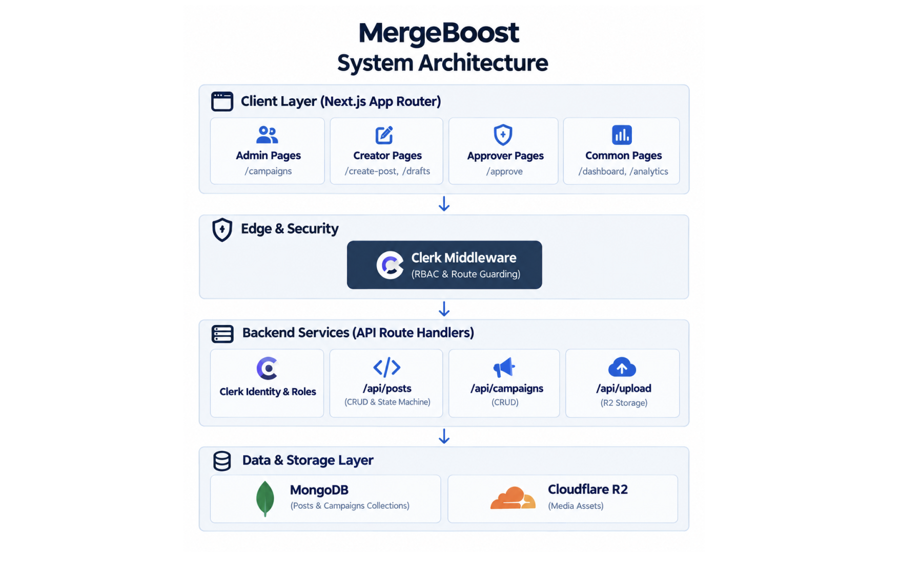
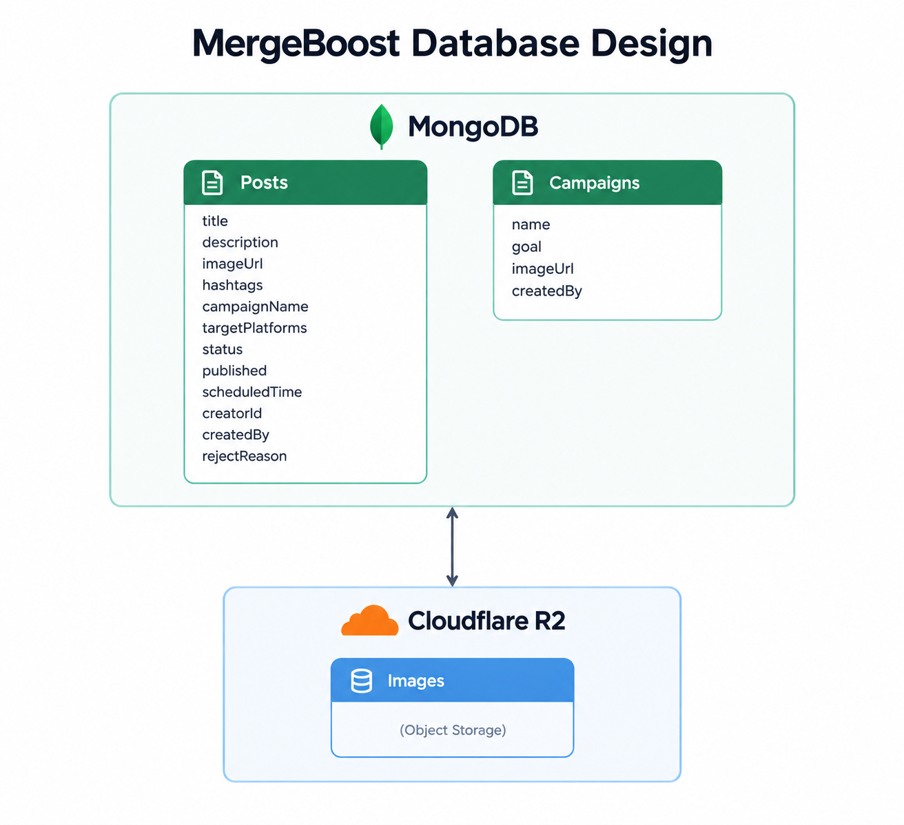

# MergeBoost - adaptogenic nootropic drinks crafted for developers, gamers, and night-owl creators.


## 📋 1. Requirement Analysis

**Overview:**  
A centralized content pipeline and dashboard platform designed to manage the lifecycle of social media posts from ideation to publication.

### ✨ Key Functional Requirements
* **Role-Based Access Control (RBAC):** Distinct user roles including Content Creators (can draft and submit), Approvers (can review, reject, or approve), and Admins (full access).
* **Content Lifecycle Management:** Posts must move through a strict state machine: `Draft` ➔ `Pending Approval` ➔ `Approved` / `Rejected` ➔ `Published` / `Scheduled`.
* **Real-time Dashboard:** A centralized view for users to track total posts, drafts, pending tasks, and live content based on their permission level.
* **Asset & Metadata Management:** Ability to attach image URLs, campaign names, target platforms, hashtags, and scheduling times to posts.

### ⚙️ Non-Functional Requirements
* **Security:** API routes must validate user sessions and roles before processing state changes.
* **Scalability:** The system must utilize a scalable NoSQL database (MongoDB) and external blob storage (R2) to handle growing media and post volumes.

---

## 🏗️ 2. System Design (Architecture)

The system follows a modern, decoupled Client-Server architecture utilizing the Next.js App Router for both frontend rendering and backend API routes.

### 🧩 Component Breakdown
* **Frontend (Client):** Next.js React components styled with Tailwind CSS, utilizing Clerk for client-side authentication states.
* **Backend (Server):** Next.js API Routes (`/api/posts`, `/api/upload`) acting as RESTful endpoints.
* **External Services:**
  * **Clerk:** Identity and Access Management (IAM).
  * **MongoDB:** Primary data persistence.
  * **Cloudflare R2 (or AWS S3):** Object storage for media uploads (handled via `lib/r2.ts`).

### 📊 Architecture Diagram



## 🗄️ 3. Database Design

The primary entity is the `Post` model. We are using a NoSQL document structure (MongoDB) via Mongoose. User data is not heavily duplicated in our DB; instead, we rely on Clerk's user IDs (`creatorId`) to link records to authenticated users.




**Collection:** `posts`

| Field | Type | Description |
| --- | --- | --- |
| `_id` | ObjectId | Unique identifier for the post. |
| `title` | String (Required) | The headline or title of the post. |
| `description` | String (Required) | The main body/caption of the content. |
| `imageUrl` | String | URL pointing to the asset stored in R2. |
| `hashtags` | Array of Strings | Associated tags for the post. |
| `campaignName` | String (Required) | The marketing campaign this post belongs to. |
| `targetPlatforms` | Array of Strings | E.g., `["Twitter", "LinkedIn", "Instagram"]`. |
| `status` | String (Enum) | Must be: `Draft`, `Pending Approval`, `Approved`, `Rejected`, `Published`, or `Scheduled`. |
| `published` | Boolean | True if live, false otherwise. Default is `false`. |
| `creatorId` | String (Required) | The unique Clerk User ID of the author. |
| `createdBy` | String | Cached name of the author for quick display. |
| `rejectReason` | String | Populated only if an Approver rejects the post. |
| `scheduledTime` | Date | Future timestamp for publishing. |
| `createdAt` / `updatedAt` | Timestamp | Automatically managed by Mongoose. |

## 🛡️ 4. Privacy & Ethical Considerations

- **Data Minimization:** We do not store passwords, raw personal identifiers, or excessive user data in our database. Identity management is completely offloaded to Clerk, an enterprise-grade identity provider, ensuring secure credential handling.
- **Strict Access Control (RBAC):** The backend API enforces strict role checks. A standard creator mathematically cannot patch a post's status to `Published` or `Approved` via API manipulation, preventing unauthorized content from going live.
- **Transparency & Feedback:** The workflow includes a `rejectReason` field. This ensures ethical management practices where creators aren't left in the dark about why their work was blocked; they receive direct, constructive feedback.
- **Consent and Ownership:** By segregating data by `creatorId`, the system inherently protects users from having their drafts viewed, edited, or deleted by peers. Only authorized managers and the original author have visibility into a specific piece of pipeline content.

## 🛠️ 5. Local Setup & Debugging Guide

This project runs as a Next.js application integrated with MongoDB, Clerk authentication, and Cloudflare R2 for asset storage. Follow this guide to set up your local development environment and troubleshoot common issues.

### 📋 Prerequisites
Ensure you have the following installed and configured before starting:
* **Node.js:** v20.x or higher
* **MongoDB:** A local or cloud-hosted instance (e.g., MongoDB Atlas)
* **Clerk Account:** For managing application authentication & roles
* **Cloudflare R2:** An active bucket for media storage

---

### ⚙️ Environment Variables Setup
Create a `.env.local` file in the root directory of your project and add the following keys:

```env
# Database Configuration
MONGODB_URI=your_mongodb_connection_string

# Clerk Authentication
NEXT_PUBLIC_CLERK_PUBLISHABLE_KEY=your_clerk_publishable_key
CLERK_SECRET_KEY=your_clerk_secret_key

# Cloudflare R2 Storage
R2_ACCOUNT_ID=your_r2_account_id
R2_ACCESS_KEY_ID=your_r2_access_key
R2_SECRET_ACCESS_KEY=your_r2_secret_key
R2_BUCKET_NAME=your_bucket_name
R2_PUBLIC_DOMAIN=https://your-public-domain
```
### 🚀 Getting Started

Install Dependencies:
npm install

Run the Development Server:
npm run dev

Access the Application:
Open your browser and navigate to http://localhost:3000.

Verify Application Health:
Run a production build check to ensure all environmental bindings and dependencies compile properly:
npm run build

Pro Tip (Hard Reset): If the application hangs or experiences cached build state issues, clear local artifacts and reinstall dependencies:
rm -rf .next node_modules
npm install
npm run dev

### 🔍 Debugging & Troubleshooting Checklist

| Issue Area | Possible Cause | Solution |
|---|---|---|
| **Database Failure** | Invalid connection string or network block. | Verify `MONGODB_URI` and ensure your local IP is whitelisted in MongoDB Atlas. |
| **Auth Failures** | Misconfigured Clerk credentials. | Confirm `NEXT_PUBLIC_CLERK_PUBLISHABLE_KEY` and `CLERK_SECRET_KEY` match your dashboard. |
| **Upload Errors** | Misconfigured object storage parameters. | Double-check your R2 access key ID, secret key, bucket name, and CORS settings. |
| **API Route Errors** | Request execution runtime errors. | Inspect server logs and test endpoints directly via `/api/posts` or `/api/upload`. |